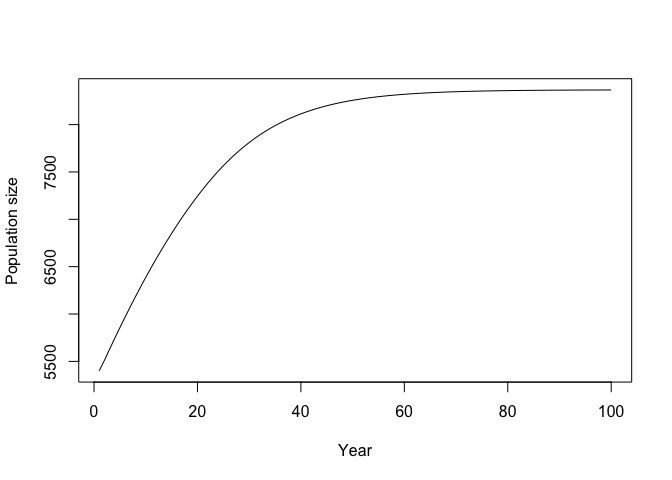

<!-- README.md is generated from README.Rmd. Please edit that file -->

# mmrefpoints: Projecting long-term marine mammal abundance with bycatch

<!-- badges: start -->

[](https://lifecycle.r-lib.org/articles/stages.html#experimental)
[](https://zenodo.org/badge/latestdoi/344858328)
<!-- badges: end -->

`mmrefpoints` is an R package that generates marine mammal population
projections based on starting abundance, life history, and bycatch
rates, based on the BALEEN II population dynamics model.

## Authors

Margaret C. Siple  
André E. Punt  
Tessa B. Francis  
Phil S. Hammond  
Dennis Heinemann  
Kristy J. Long  
Jeffrey E. Moore  
Maritza Sepulveda  
Randall R. Reeves  
Guðjón Már Sigurðsson  
Gísli Víkingsson  
Paul R. Wade  
Rob Williams  
Alexandre N. Zerbini

## Contents

-   [Need](#need)
-   [Details](#details)
-   [Installation](#installation)
-   [Contributing](#contributing)
-   [References](#references) <!-- end toc -->

## Need

Stakeholders involved in the management of marine mammal bycatch in
marine fisheries need tools to simulate the effects of management
decisions on marine mammal populations. Population models are a key part
of this process. This package contains the tools to simulate marine
mammal populations and an app that shows model outputs in a
user-friendly way.

## Details

This R package contains the functions used in the Marine Mammal Bycatch
Impacts Exploration Tool (MMBIET), a Shiny app built by Margaret Siple,
André Punt, and the Ocean Modeling Forum’s [Marine Mammal Bycatch
Working
Group](https://oceanmodelingforum.org/working-groups/marine-mammal-bycatch-working-group/).

The functions in this package, and the Shiny app, are intended to be
used in cases where data on bycatch and/or population status are sparse
or unavailable.

Our target audience is stakeholders interested in projecting marine
mammal populations to examine the impacts of bycatch. Those code could
also be used as a teaching tool, or for anyone who is more familiar with
R than FORTRAN and wants to use some components of the BALEEN II model
(Punt 1999).

## Installation

This package can be downloaded directly from GitHub:

    devtools::install_github("mcsiple/mmrefpoints")

## Contributing [](https://github.com/dwyl/esta/issues)

### Community guidelines

We would like this package to be sustainable in the long term and
welcome contributions. If you encounter a bug, please leave a note on
the Issues page. You can also leave comments there about additional
functionality (please add the “enhancement” label to your issue). If you
are interested in contributing, we direct you to the R package
[contribution advice](http://r-pkgs.had.co.nz/git.html) from Hadley
Wickham.

## Accessing the MMBIET Shiny app

The functions in this package can also be accessed through the Shiny app
for this project, which is located online
[here](https://msiple.shinyapps.io/mmrefpoints/). The app provides an
easy way to explore outcomes and print out a report with inputs and
outputs.

The mmBIET Shiny app can also be accessed through the R package:

``` r
library(mmrefpoints)
run_app()
```


## Functionality

Key functions in this package:

| Function      | Purpose                                                         |
|:--------------|:----------------------------------------------------------------|
| dynamics()    | Generate a single trajectory for marine mammal population size  |
| projections() | Generate several trajectories for marine mammal population size |

To create a single projection for a marine mammal population, use the
`dynamics()` function:

``` r
x <- mmrefpoints::dynamics(S0 = 0.944, S1plus = 0.99, K1plus = 9000, AgeMat = 17,
InitDepl = 0.6, ConstantCatch = NA, ConstantF = rep(0.01, times = 100), z = 2.39, nyears = 100, nages = 25, lambdaMax = 1.04)
plot(1:100, x$TotalPop, type = 'l', xlab = "Year", ylab = "Population size")
```



## References

Punt, A. E. 1999. Annex R: A full description of the standard Baleen II
model and some variants thereof. Division of Marine Research, CSIRO
Marine Laboratories, Hobart, Australia. Available from
<https://duwamish.lib.washington.edu/uwnetid/illiad.dll?Action=10&Form=75&Value=1651729>
(accessed August 7, 2018).

## How to cite

To cite this package or the MMBIET Shiny app, please use the following
citation:

> Margaret C. Siple, André E. Punt, Tessa B. Francis, Phil S. Hammond,
> Dennis Heinemann, Kristy J. Long, Jeff Moore, Maritza Sepulveda,
> Randall R. Reeves, Guðjón Már Sigurðsson, Gísli Víkingsson, Paul R.
> Wade, Rob Williams, and Alexandre N. Zerbini (t.b.d.). mmrefpoints:
> Projecting long-term marine mammal abundance with bycatch. R package
> version 1.0.0. url: <https://github.com/mcsiple/mmrefpoints> doi:
> 10.5281/zenodo.4758402
